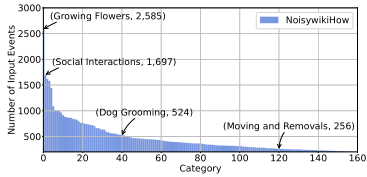
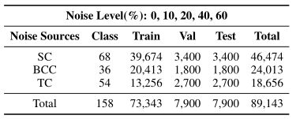
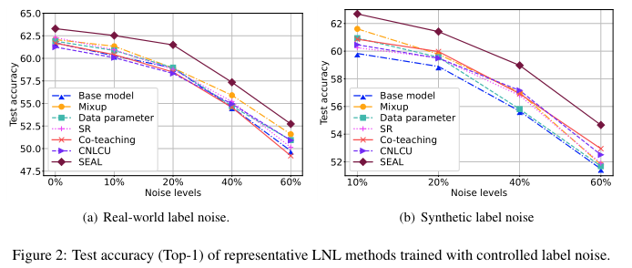
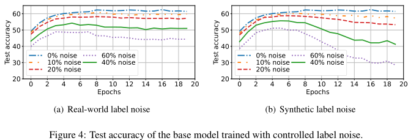

# NoisywikiHow

a Benchmark for Learning with Real-world Noisy Labels in Natural Language Processing

## Brief Introduction

**NoisywikiHow** is currently the largest benchmark dataset for noisy label learning in the field of NLP, as of January 2023. It comprises 89K procedural events with heterogeneous and controlled real-world label noise. The dataset was constructed by crawling, filtering and processing data from the [wikiHow](https://www.wikihow.com) website up until March 2022. 

After meticulous filtering and selection, the dataset contains 158 disjoint classes with a long-tail distribution and a total of 89,143 steps. To simulate real-world scenarios and account for human cognitive patterns and category similarities, we injected noise from multiple sources in proportionate amounts.

This dataset can be used for intent recognition tasks, where the goal is to determine the implied intent given a meaningful step or instruction. Here are some instances:

| procedual event                                 | intent        |
| ----------------------------------------------- | ------------- |
| Take presciption weight loss medications.       | Losing Weight |
| Check calories on food packaging.               | Losing Weight |
| Include cultural and ethnic foods in your plan. | Losing Weight |
| Talk about food differently.                    | Losing Weight |

## Statistics

1. Data volume during data processing

   | Stage                                          | step    | intention |
   | ---------------------------------------------- | ------- | --------- |
   | Collecting                                     | 1394307 | 3334      |
   | Normalization and deduplication                | 1134522 | 3334      |
   | TF-IDF filter                                  | 777135  | 3334      |
   | Sample size filter & intention label filtering | 89143   | 158       |

   We have retained two sets of 50 steps each as validation and test sets for each intent.

2. The training set of NoisywikiHow exhibits a long-tail distribution.

   

3. Overview of NoisywikiHow of multiple noise sources and controlled label noise.

   To introduce label noise from open set and Keep the number of target categories unchanged, when injecting label noise into an instance (x,y), we leave the label y unchanged but replace the procedual event x with the one x2 under the category y2, which may not be in the existing 158 classes.

   Noise sources:

   + SC: sub-categories
   + BCC: categories beyond the commonsense
   + TC: tail categories

## Results

1. Top-1 (Top-5) classification test accuracy (%) of pre-trained language models

   | Model/Noise Level | 0%               | 10%              | 20%              | 40%              | 60%              |
   | ----------------- | ---------------- | ---------------- | ---------------- | ---------------- | ---------------- |
   | BERT              | 60.29(83.53)     | 58.86(83.32)     | 57.42(82.57)     | 52.91(79.84)     | 48.20(75.37)     |
   | XLNET             | 59.77(85.24)     | 60.23(85.90)     | 58.25(84.29)     | 53.74(81.73)     | 50.23(79.44)     |
   | RoBERTa           | 60.59(85.10)     | 59.65(84.16)     | 57.77(83.77)     | 54.18(81.56)     | **50.85(78.87)** |
   | GPT2              | 59.84(85.39)     | 58.35(84.90)     | 57.0(83.94)      | 52.71(80.81)     | 48.25(78.08)     |
   | ALBERT            | 55.13(80.80)     | 56.21(82.15)     | 53.68(80.52)     | 49.93(78.44)     | 44.81(74.41)     |
   | T5                | 58.35(83.63)     | 56.87(83.03)     | 56.19(82.20)     | 52.29(79.94)     | 47.47(77.39)     |
   | BART              | **61.72(86.90)** | **60.28(85.92)** | **58.94(84.67)** | **54.57(82.38)** | 49.75(78.84)     |

   We use BART model as the **base model**.

2. Effects of Distinct Noise Sources under 10% label noise. 

   | Noise Sources             | Top-1 | Top-5 |
   | ------------------------- | ----- | ----- |
   | SCC+BCC+TC (NoisywikiHow) | 60.28 | 85.92 |
   | SC                        | 60.14 | 85.49 |
   | BCC                       | 59.65 | 85.39 |
   | TC                        | 57.99 | 84.37 |

3. Effectiveness of Different LNL methods

   

 4. Real-world Noise vs. Synthetic Noise

    

## New Findings

+ Some widely accepted LNL methods are not always impactful, especially with
  real-world label noise.
+ Different noise sources may have varying difficulties resisting label noise,
  although they are all from real-world noise.
+ Few LNL methods can effectively combat real-world noise and synthetic noise at the same time.
+ The model trained under the real-world label noise has better generalization performance.

## Run baseline
To run baseline on NoisywikiHow, you can follow the guide in [TORUN.md](TORUN.md).